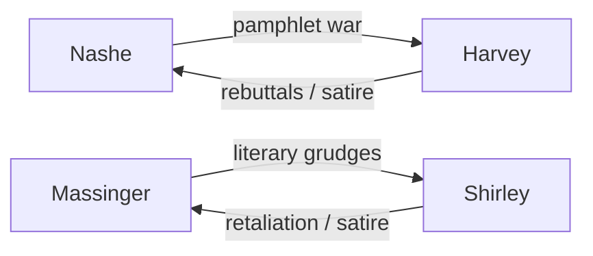
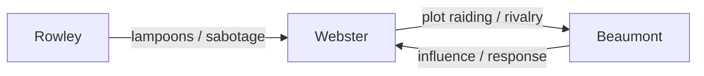
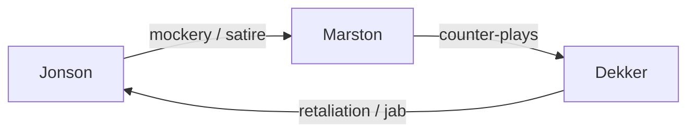
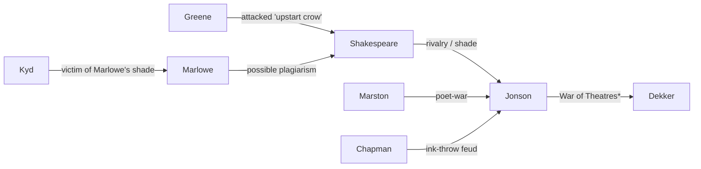

# *The Dark Stage*  

> **Part III - Mapping the Taboo**   
> Focus : Taxonomy of transgression, social and moral networks, backstage rivalries and scandal.  

### 🗣️ Secrets, Scandals & Stage Intrigue
Behind the grand curtains of the stage, the playwrights were not only chroniclers of human folly, they were its participants.  
The `dark_stage.md` collects the **juicy, behind-the-scenes stories, rivalries and literary feuds** that shaped Elizabethan, Jacobean and Caroline drama.

Each record captures a **personal, professional or theatrical anecdote**, offering a structured glimpse into the **social, political and creative dynamics** of the period.

* **Scope :** 20 core dramatists `creators.md`
* **Content :** Rivalries, duels, censorship, collaborations, scandals, witty repartees
* **Unit of analysis :** One anecdote, incident per row
* **Purpose :** Reveal the **human drama offstage**, showing how ambition, envy and wit influenced plays, collaborations, literary history
* **Relational scope :** Linked to `author_id`, `play_id`, optionally `creature_id` when incidents involve characters

This dataset is a **lens on personality, networks and social interplay**.   
Complementing `creators.md` and `creatures.md` by highlighting **the intrigues that fueled the Renaissance theatre ecosystem**.

`dark_stage.md` turns the stage lights on the **human stories behind the plays**.  
From whispered betrayals to public spats, showing that **the drama offstage was sometimes as intense as the drama onstage**.

### 🗣️ Columns Guide
- **author_id**, the dramatist involved, linked to `creators.md`  
- **play_id**, the play concerned (if applicable)  
- **creature_id**, the character involved, unwitting actor in the backstage drama  
- **incident_type**, the nature of chaos :  
    - Rivalry, Duel, Censorship, Collaboration, Scandal, Witty Repartée, etc.  
- **anecdote**, the juicy story :    
    - Duels, Betrayals, Quips, Literary Feuds, etc.  
- **intensity**, scale of impact, measuring drama magnitude :  
    - Minor, Notable, Epic, etc.  
- **sentiment**, the emotional or moral undertone :
    - `jealousy`, `grudge`, `admiration`, `humiliation`, `cunning`, `romantic_intrigue`, etc.   
- **stage_mood**, expressive emoji highlighting the gossip (😏😡🤫...)  
- **period**, approximate year or range, situating the scandal in time  
- **location**, where it happened, the stage of backstage drama :  
  - Theatre, Tavern, Royal Court, etc.  
- **notes**, sources, critical references, commentary, backing up the tale

### 🗣️ Tension Diagrams
Not all authors appear on these stages. Those absent from the diagrams include : **Lyly**, **Peele**, **Heywood**, **Fletcher**, **Ford**. Their intrigues subtler, their feuds less scandalous.  

**The “War of the Theatres” was a battle of quills and pride : **Jonson**, **Marston** and **Dekker** traded theatrical blows, mocking rivals in plays as the city watched.*

### 🗣️ Sample from the Cleaned Dataset

#### 🗝️ Stage Mood Legend 
😏 = Smirk, 🙃 = Irony, 😡 = Anger/Rivalry/Feud, 😬 = Awkwardness, 😢 = Regret/Loss/Fall, 😳 = Embarrassment,   
🫢 = Outrage/Transgression, 🤫 = Secrecy/Gossip/Taboo, 🤔 = Suspicion/Intrigue, 😱 = Shock/Scandal/Revelation,   
😈 = Mischief/Trick, 🤡 = Mockery/Ridicule, 🤝 = Alliance/Truce, 🥂 = Celebration/Success, 😤 = Frustration/Envy/Pride,   
😭 = Breakdown/Despair, 🥰 = Affection/camaraderie, 🫣 = Embarrassed curiosity/Hesitant interest, 🥴 = Confusion/Excess,   
😵‍💫 = Madness/Obsession	

---

🎭 `creators.md` → who writes   
✨ `creatures.md` → who acts   
🗣️ `dark_stage.md` → where transgression unfolds   
